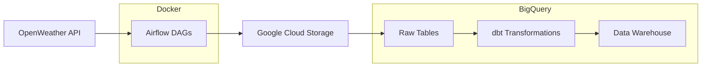
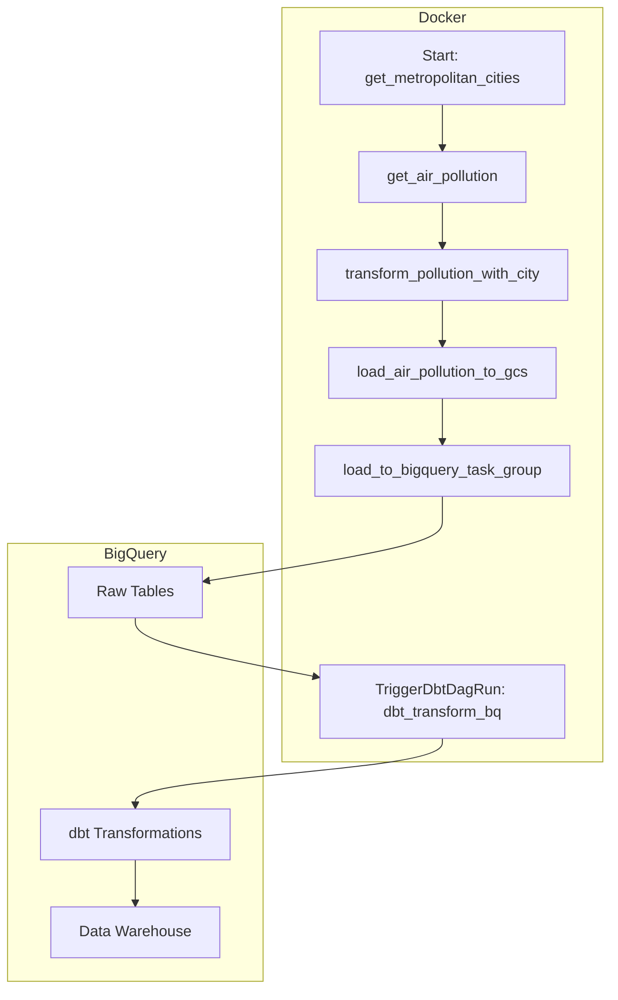
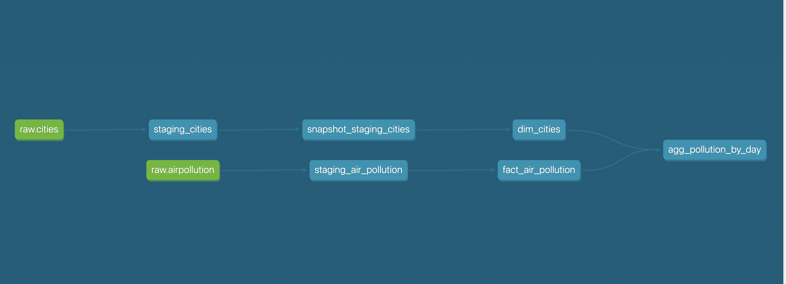

# 🇫🇷 Air Pollution Data Pipeline for French Metropolitan Cities

An ETL data pipeline orchestrated with **Apache Airflow**, **Python** and **BigQuery** that collects, transforms, and analyzes air pollution data for French metropolitan areas.
---

## 📌 Overview

This project automates the end-to-end process of gathering, processing, and analyzing air quality data — with a focus on **PM2**, **PM10** and **NO2** levels. It includes daily ingestion, historical backfilling, transformation using **dbt**, and statistical analysis.

Explore the dashboard [Air Pollution Dashboard](https://lookerstudio.google.com/reporting/6a72e259-db85-43f7-ba61-f70102859de1/page/k4KKD)
---

## ⚙️ Pipeline Features

### 🗓 Daily Updates
- Scheduled at **00:15 AM Paris time** to fetch the previous day's air pollution metrics (e.g., PM2.5, PM10, NO₂, ...).

### 🕰 Historical Backfill
- Supports loading pollution data from **any date in the past up until the beginning of today**.

## 📊 Statistical Analysis

Collected data is used to perform **hypothesis testing** to evaluate whether there is a **statistically significant difference in NO₂ pollution levels between weekdays and weekends** in Paris.
You can explore the experiment and analysis code in the [`hypothesis-testing/`](./hypothesis-testing/) directory.

---

## 🛠 Tech Stack

- **Docker** – containerization for environment management
- **Python** – for ingestion and statistical analysis  
- **Airflow** – orchestration and scheduling
- **Google Cloud Storage (GCS)** – storage for raw and intermediate data files  
- **dbt** – data modeling and quality checks  
- **BigQuery** – cloud data warehouse  
- **Pandas / SciPy** – for hypothesis testing  

## Architecture


## 🗂 Airflow DAG

This project uses **Apache Airflow** (running in Docker) to orchestrate the entire pipeline. It includes two main DAGs:

- **`prev_day_air_pollution`**: Runs daily at **00:15 AM (Paris time)** to fetch the previous day's pollution data.
- **`history_pollution`**: Supports **historical backfill** for any date range up to the current date.

Once ingestion is complete, Airflow triggers a **dbt transformations DAG** to model and transform the data in **BigQuery**.
Below is the diagram of the **prev_day_air_pollution** DAG.

Each task performs a specific function in the pipeline:

- `get_metropolitan_cities`:  Retrieves the list of French metropolitan cities, including city information such as geographic coordinates (longitude and latitude), which are used as input parameters for fetching air pollution data.
- `get_air_pollution`: Get air pollution data for each city from Weather API.
- `transform_pollution_with_city`: Performs data cleaning and transformation on the raw API data(e.g, column renaming, datetime format conversion).
- `load_air_pollution_to_gcs`: Uploads the processed data to Google Cloud Storage (GCS) as Parquet files.
- `load_to_bigquery_task_group`: Loads data from GCS into the raw BigQuery tables.
- `dbt_transform_bq`: Trigger data transformation steps(dbt) to further process data in BiqQuery.

More details and implementation can be found in  [`dags/prev_day_pollution.py`](./dags/prev_day_pollution.py).


### 🔄 Transformations with dbt

Once raw data is ingested into the **raw BigQuery tables**, dbt transformations are automatically triggered by Airflow to convert raw data into structured format, optimized for analysis.

The transformation layer follows a **star schema** structure:
- **Fact table**: `fact_airpollution` – This table contains hourly air pollution metrics for French metropolitan cities, including a qualitative air quality indicator (e.g., Good, Fair, Poor), similar to the Air Quality Index (AQI). Each record represents pollution levels at a specific hour for a given city.

| city_id | city_index | timestamp_utc           | date       | pollution_quality | carbon_monoxide_co | nitric_oxide_no | nitrogen_dioxide_no2 | ozone_o3 | sulfur_dioxide_so2 | pm2_5 | pm10  | nh3  |
|---------|------------|--------------------------|------------|-------------------|---------------------|------------------|------------------------|----------|----------------------|--------|--------|------|
| 1       | 26         | 2021-03-10 00:00:00 UTC  | 2021-03-10 | Fair              | 0.54                | 10.63            | 17.86                  | 16.08    | 55.79                | 257.02 | 4.69   | 0.00 |
| 2       | 102        | 2021-03-10 00:00:00 UTC  | 2021-03-10 | Moderate          | 1.52                | 40.44            | 29.94                  | 26.23    | 0.65                 | 534.06 | 57.25  | 6.31 |


- **Dimension tables**:  
  - `dim_cities` –  metadata for each city, implemented as a **Slowly Changing Dimension Type 2 (SCD2)** to track changes such as city name or region, preserving historical air pollution data over time.
  
- **Mart**: `avg_pollution_by_day` – aggregated average pollution levels per city per day.

| city             | region                      | date       | pollution_quality | avg_CO | avg_NO | avg_NO2 | avg_O3 | avg_SO2 | avg_PM2_5 | avg_PM10 | avg_NH3 |
|------------------|------------------------------|------------|-------------------|--------|--------|---------|--------|----------|------------|-----------|---------|
| Aix-en-Provence  | Provence-Alpes-Côte d’Azur  | 2021-03-10 | Moderate          | 1.27   | 9.15   | 16.68   | 15.50  | 70.44    | 279.51     | 6.61      | 0.61    |
| Aix-en-Provence  | Provence-Alpes-Côte d’Azur  | 2021-03-11 | Moderate          | 2.75   | 18.32  | 23.63   | 20.68  | 50.09    | 330.17     | 4.66      | 1.63    |


- Lineage graph illustrating the flow of air pollution data transformations in BigQuery using dbt.



**Data Integrity and Quality Checks with dbt tests:**
- Ensure primary key uniqueness and not-null constraints on dimension and fact tables.
- Validate data types and formats to confirm data was inserted correctly (e.g., numeric fields).
- Custom test to **verify that the latest date is present** in the data, confirms that daily ingestion is running as expected.

## 🚀 How to Run

### Prerequisites

- [Docker](https://www.docker.com/get-started) installed and running  
- [Astro CLI](https://airflow.apache.org/docs/astro-cli/stable/get-started/installation.html) installed. Astronomer is a managed platform and service that simplifies the deployment, scaling, and monitoring of Apache Airflow workflows.
- [Terraform](https://www.terraform.io/downloads) installed (version 1.0 or higher recommended).  
- [Google Cloud SDK](https://cloud.google.com/sdk/docs/install) installed and authenticated (`gcloud auth login`)  
- A Google Cloud project with permissions to create Storage buckets and BigQuery datasets.
- Google Cloud service account with BigQuery and GCS permissions, and the JSON key file downloaded.
- 🔑 Get a free OpenWeather API key from [OpenWeather Air Pollution API](https://openweathermap.org/api/air-pollution).

#### Google Cloud Setup
Before running the project, set up your Google Cloud environment:
- Create a Google Cloud project.   
- Create a Google Cloud service account with permissions to:  
  - Read and write BigQuery datasets.
  - Read and write to Google Cloud Storage buckets.
- Download the service account JSON key file.  

#### 📦 Infrastructure with Terraform

This project uses [Terraform](https://www.terraform.io/) to provision required Google Cloud resources.

#### Setup Instructions

1. **Install Terraform**  
   Ensure [Terraform ≥ 1.0](https://www.terraform.io/downloads) is installed on your system.

2. **Set Up Google Cloud Credentials**  
   - Create a service account with access to BigQuery and GCS.  
   - Download the service account key file and set the environment variable:  
     ```bash
     export GOOGLE_APPLICATION_CREDENTIALS="/path/to/your/service-account-key.json"
     ```

3. **Configure Terraform Variables**  
   - Navigate to the [`terraform/`](./terraform/) folder.
   - Open `main.tf` and `variables.tf`, and replace placeholders like:
     - `your-project-id` in `project`  
     - Update `region`, dataset names,storage class accordingly. 

4. **Initialize and Apply Terraform**  
   ```bash
   cd terraform/
   terraform init
   terraform apply
### Configure environment variables
Create a `.env` file in the project root:
```env
API_KEY=your_weather_api_key
GCP_PROJECT_ID=your-gcp-project-id
GCS_BUCKET_NAME=your_bucket_name
```
### Airflow Connection With Google Cloud 
- Start Airflow and all services with Astro CLI:

```bash
astro dev start
``` 

- Copy your Google Cloud service account JSON key file from your local machine to the `include/keys/` directory inside the project, replace `your-service-account-file-name.json` with your actual file name.

From the **root of the project**, run:

```bash
cp /path/to/your/service-account-file.json include/keys/your-service-account-file-name.json
```

Open the Airflow UI at [http://localhost:8080](http://localhost:8080).

#### Set up the Google Cloud connection in Airflow UI:

1. Go to **Admin → Connections**.
2. Click the **"+"** button to add a new connection.
3. Enter the following details:
   - **Conn Id**: `google_cloud_default` (or the connection ID your DAGs use)
   - **Conn Type**: `Google Cloud`
   - **Keyfile Path**: `/usr/local/airflow/include/keys/your-service-account-file-name.json`
4. Save the connection.
5. Restart Airflow with Astro CLI
```bash
astro dev restart
```

## 🚀 Running the Pipeline

### Triggering the Pipeline

- Once Airflow is running, open the Airflow UI at [http://localhost:8080](http://localhost:8080).
- Navigate to the **DAGs** page.
- Enable the following DAGs by toggling the switch:
  - `prev_day_air_pollution` daily data ingestion.
  - `history_pollution` fetches data from past dates up until the beginning of today.
  **Note:**
**Note:**  
- When triggering this DAG manually, provide the start date in `DD-MM-YYYY` format as a parameter.  
- Also, if you wish to create your own pipeline for your country, which has a different timezone, replace ``"Europe/Paris"`` with your timezone in the following files:  
  [`include/constants/date_time.py`](./include/constants/date_time.py),  
  [`models/staging/staging_air_pollution.sql`](./dbt/france_air_pollution/models/staging/staging_air_pollution.sql),  
  [`models/mart/agg_pollution_by_day.sql`](./dbt/france_air_pollution/models/mart/agg_pollution_by_day.sql).

    
- To run the pipeline immediately, click the **Trigger DAG** button next to the DAG name.


### Monitoring Pipeline Runs
- Monitor the status of DAG runs on the Airflow UI.
- Click on the DAG name, then select the specific run to view task-level statuses.
- Access logs for each task to troubleshoot any issues during ingestion, loading, or transformations.

### Verifying Results
- After successful pipeline runs, the data will be available in your configured **BigQuery** datasets.
- Use the BigQuery web UI to query the `agg_pollution_by_day` or `fact_air_pollution` tables, and create visualizations based on the data.
- For statistical analysis, explore the [`hypothesis-testing/`](./hypothesis-testing/) directory for code and experiments.
